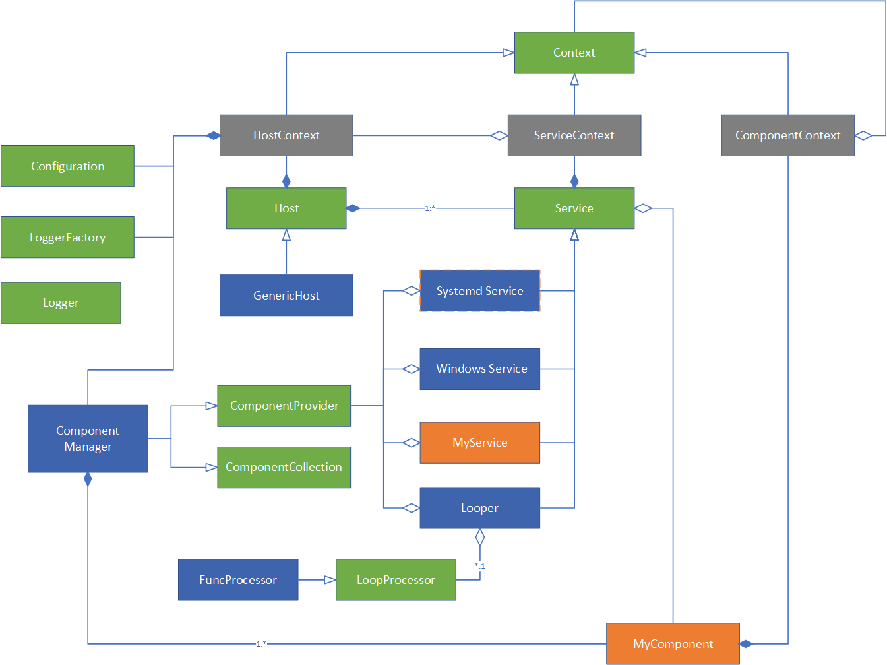

# Architecture

## Diagram

Below is the diagram for hosting model:

In most cases, developer does not need to deal with components of hosting framework, they just define and implement their own components and services, register them to the host, and then build and run the host. 

Check [Samples](./samples/README.md) for more details, and check [Concepts](./concepts/README.md) to understand more advanced usage.

## Code Package

hosting framework involves below packages:

- package types: encapsulate type reflections and "func" type and functionalities.
- package logger: logger interface and logger factory.
- package dep: dependency management capabilities
- package hosting: core part of hosting framework