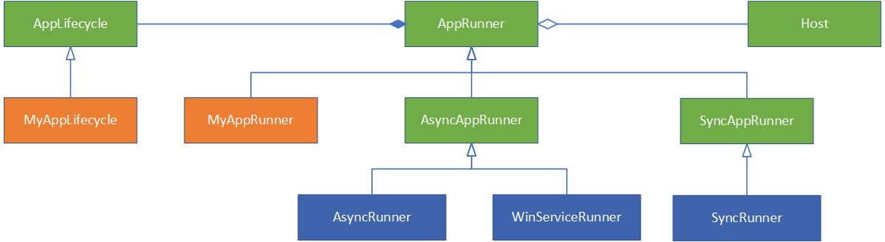

# AppRunner

Application Runner is the one driving the execution of the application. 

It also manages the lifecycle of the application, and calls relevant lifecycle callbacks if registered.

Above diagram shows the relationship between AppRunner, Host and AppLifecycle. 

There are two types of AppRunner:

- AsyncAppRunner: it starts hosted services in host within separate threads(go routine) and wait for stop signal before shutting them down. this means the main thread does not run actual service code, instead it controls hosted service starting/stopping, or just wait for stop signal.
- SyncAppRunner: it runs the main service directly in the main thread until complete. this means it cannot run multiple hosted services at the same time, and it does not respond to stop signal in the runner. So the applicaiton process will be killed if customer code does not handle it either.

You can also define your own AppRunner if you have special app running procedure. the framework also implement one: WinServiceRunner - which runs as a Windows service.

AppRunner refers to the Host component to drive the execution, and use a AppLifecycle component to notify events/callbacks to customized applicaiton code.

Each AppRunner can have their own AppLifecycle component type, depending on how they run the hosted services.